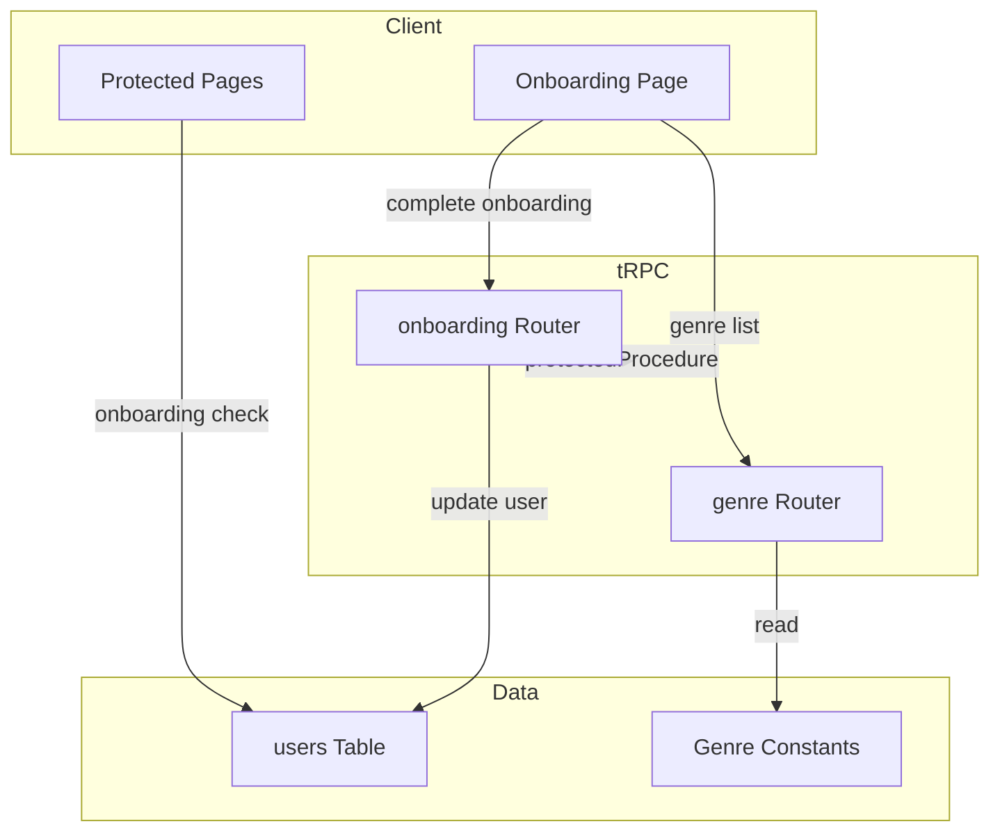
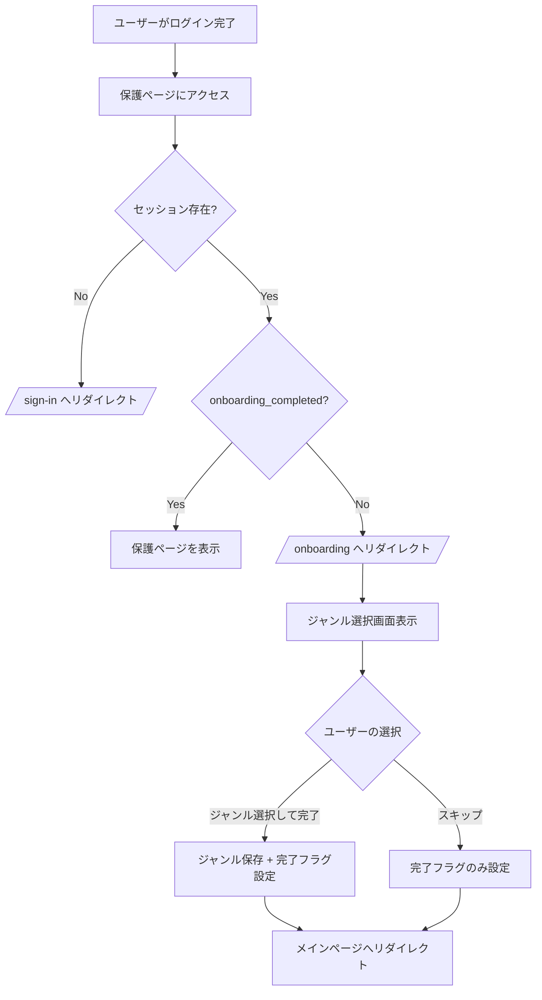
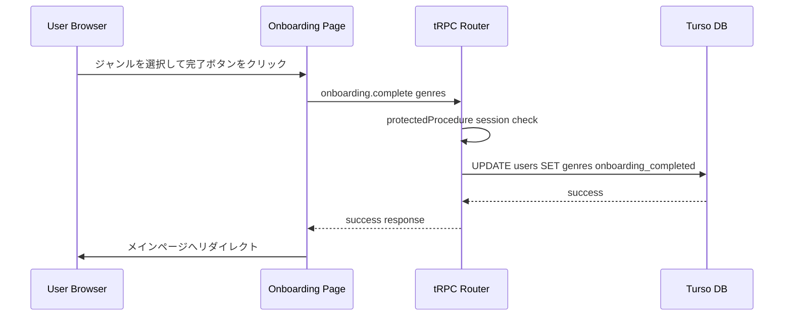
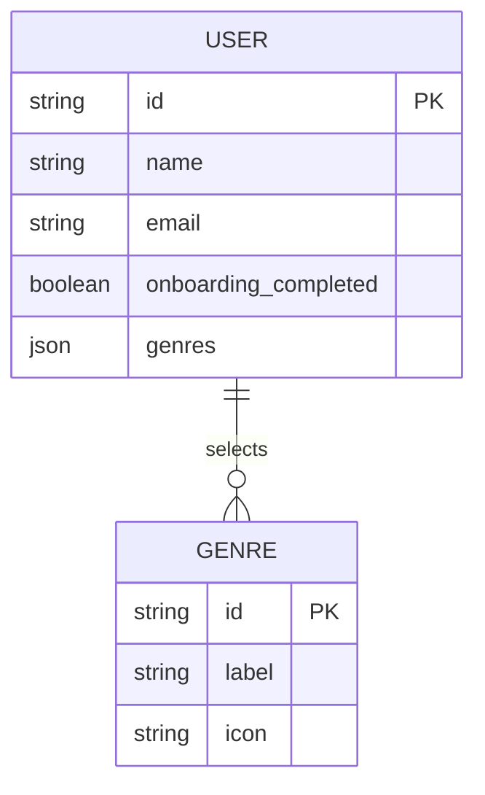

# Technical Design: auth-expansion (オンボーディング)

> **Note**: Google OAuth 認証（Requirement 1）の設計と実装は完了済み。本ドキュメントはオンボーディングフロー（Requirement 4）に焦点を当てる。

## Overview

**Purpose**: 本機能は初回ログインユーザーに対してジャンル選択オンボーディングフローを提供し、パーソナライズされたコンテンツ推薦の基盤を構築する。

**Users**: 新規ユーザーが初回ログイン時にオンボーディング画面でジャンルを選択し、アプリケーションの利用を開始する。既存ユーザーはオンボーディングをスキップしてメインページに直接アクセスする。

**Impact**: `users` テーブルにオンボーディング完了フラグとジャンル情報のカラムを追加する。保護ページのサーバーコンポーネントにオンボーディング状態チェックを導入し、tRPC ルーターにオンボーディング関連のプロシージャを追加する。

### Goals
- 初回ログインユーザーのオンボーディング画面への自動リダイレクト
- ジャンル一覧の表示と選択機能の提供
- 選択ジャンルの永続化とオンボーディング完了フラグの設定
- オンボーディング未完了ユーザーの保護ページアクセス制御
- オンボーディングのスキップ機能

### Non-Goals
- LINE 認証の実装（Requirement 2 -- 別途対応）
- プロフィール編集機能（Requirement 3 -- 別途対応）
- ジャンルに基づくコンテンツ推薦ロジックの実装
- ジャンルマスターデータの管理画面
- オンボーディング完了後のジャンル再編集（プロフィール編集で対応予定）

## Architecture

### Existing Architecture Analysis

現在のシステムは以下のパターンを実装済みである。

- **認証基盤** (`lib/auth.ts`): Better Auth によるメール/パスワード、GitHub OAuth、Google OAuth、匿名ログインを構成済み
- **保護ページ制御** (`app/page.tsx`): サーバーコンポーネントで `auth.api.getSession` を呼び出し、未認証ユーザーを `/sign-in` へリダイレクト
- **tRPC プロシージャ階層** (`trpc/init.ts`): `baseProcedure` / `protectedProcedure` / `subscribeProcedure` が定義済み。セッション情報は `ctx.auth` で利用可能
- **DB スキーマ** (`db/schemas/auth.ts`): `users` テーブルに `id`, `name`, `email`, `image`, `isAnonymous` 等のカラムが存在。オンボーディング関連フィールドは未定義

### Architecture Pattern & Boundary Map

オンボーディングフローは既存アーキテクチャの拡張として実装する。新たなアーキテクチャパターンの導入は不要。



**Architecture Integration**:
- **Selected pattern**: 既存の Feature-first + tRPC プロシージャ階層パターンを踏襲
- **Domain/feature boundaries**: オンボーディングは認証ドメインの拡張。`components/features/onboarding/` と `trpc/routers/onboarding.ts` に集約
- **Existing patterns preserved**: サーバーコンポーネントでのリダイレクト制御、`protectedProcedure` による認証チェック、Drizzle ORM によるデータアクセス
- **New components rationale**: オンボーディング UI コンポーネント（ジャンル選択画面）、tRPC ルーター（オンボーディング状態管理）、DB スキーマ拡張（完了フラグ・ジャンル保存）が必要
- **Steering compliance**: TypeScript strict mode、Feature-first 構造、shadcn/ui コンポーネント利用、tRPC による型安全 API を維持

### Technology Stack

| Layer | Choice / Version | Role in Feature | Notes |
|-------|------------------|-----------------|-------|
| Frontend | React 19 + Next.js 16 | オンボーディング UI、サーバーコンポーネントでのリダイレクト制御 | 既存パターンの拡張 |
| Backend | tRPC 11.9 + better-auth 1.3.26 | オンボーディング API プロシージャ、セッション管理 | `protectedProcedure` を利用 |
| Data | Turso (libSQL) + Drizzle ORM 0.45 | `users` テーブルへのカラム追加、ジャンルデータの永続化 | マイグレーション必要 |
| UI | shadcn/ui + Tailwind v4 | ジャンル選択 UI コンポーネント | 既存コンポーネントライブラリを活用 |
| Validation | zod 4.3 | オンボーディング入力のバリデーション | tRPC input スキーマで利用 |

## System Flows

### オンボーディングリダイレクトフロー



**Key Decisions**:
- オンボーディングチェックはサーバーコンポーネントで実行する。Middleware は Better Auth のセッション API 呼び出しが必要でパフォーマンスの懸念があるため採用しない
- `/onboarding` ページ自体はオンボーディングチェックの対象外とし、リダイレクトループを防止する

### オンボーディング完了シーケンス



## Requirements Traceability

| Requirement | Summary | Components | Interfaces | Flows |
|-------------|---------|------------|------------|-------|
| 4.1 | 初回ログイン後にオンボーディング画面へリダイレクト | OnboardingGuard, Protected Pages | getOnboardingStatus | オンボーディングリダイレクトフロー |
| 4.2 | 選択可能なジャンル一覧を表示 | OnboardingView, GenreSelector | genre.list | -- |
| 4.3 | 選択ジャンルの保存と完了フラグの設定 | OnboardingView, onboarding Router | onboarding.complete | オンボーディング完了シーケンス |
| 4.4 | オンボーディング完了後にメインページへリダイレクト | OnboardingView | -- | オンボーディング完了シーケンス |
| 4.5 | オンボーディング未完了ユーザーの保護ページアクセス時リダイレクト | OnboardingGuard | getOnboardingStatus | オンボーディングリダイレクトフロー |
| 4.6 | オンボーディング完了済みユーザーのスキップ | OnboardingGuard | getOnboardingStatus | オンボーディングリダイレクトフロー |
| 4.7 | ジャンル未選択でのオンボーディングスキップ | OnboardingView | onboarding.complete | オンボーディング完了シーケンス |
| 6.2 | protectedProcedure でオンボーディングエンドポイント提供 | onboarding Router | protectedProcedure | -- |
| 6.3 | baseProcedure でジャンル一覧取得提供 | genre Router | baseProcedure | -- |

## Components and Interfaces

| Component | Domain/Layer | Intent | Req Coverage | Key Dependencies (P0/P1) | Contracts |
|-----------|--------------|--------|--------------|--------------------------|-----------|
| OnboardingGuard | Shared / Auth | 保護ページでオンボーディング未完了ユーザーをリダイレクトする | 4.1, 4.5, 4.6 | auth.api.getSession (P0), Drizzle ORM (P0) | -- |
| OnboardingView | UI / Onboarding | オンボーディング画面のジャンル選択 UI | 4.2, 4.3, 4.4, 4.7 | tRPC Client (P0), GenreSelector (P1) | State |
| GenreSelector | UI / Onboarding | ジャンル一覧の表示と選択操作 | 4.2 | shadcn/ui (P1) | State |
| onboarding Router | Backend / tRPC | オンボーディング完了処理の API | 4.3, 4.7, 6.2 | protectedProcedure (P0), Drizzle ORM (P0) | Service |
| genre Router | Backend / tRPC | ジャンル一覧取得 API | 4.2, 6.3 | baseProcedure (P0), Genre Constants (P0) | Service |
| Genre Constants | Shared / Constants | ジャンルマスターデータの定義 | 4.2 | -- | -- |
| users Schema Extension | Data / Schema | オンボーディング関連カラムの追加 | 4.3 | Drizzle ORM (P0) | -- |

### Shared / Auth

#### OnboardingGuard

| Field | Detail |
|-------|--------|
| Intent | 保護ページのサーバーコンポーネントでオンボーディング未完了ユーザーを `/onboarding` へリダイレクトする |
| Requirements | 4.1, 4.5, 4.6 |

**Responsibilities & Constraints**
- セッション取得後にユーザーの `onboarding_completed` フラグを DB から確認する
- 未完了の場合は `redirect("/onboarding")` を呼び出す
- 完了済みの場合は何もしない（ページ描画を続行）
- `/onboarding` ページ自体ではこのガードを適用しない（リダイレクトループ防止）
- 匿名ユーザー（`isAnonymous: true`）はオンボーディング対象外とする

**Dependencies**
- External: `auth.api.getSession` -- セッションからユーザー ID を取得 (P0)
- External: Drizzle ORM -- `users` テーブルからオンボーディング状態をクエリ (P0)

**Contracts**: なし（サーバーサイドユーティリティ関数として実装）

```typescript
// サーバーコンポーネントから呼び出す非同期関数
type CheckOnboardingStatus = (userId: string) => Promise<{
  completed: boolean;
  genres: string[];
}>;
```

**Implementation Notes**
- Integration: 既存の `app/page.tsx` のセッション確認パターンを拡張する。セッション取得後に `users` テーブルから `onboarding_completed` を問い合わせる
- Validation: `userId` はセッションから取得するため、追加バリデーション不要
- Risks: 保護ページが増えるたびにチェック呼び出しが必要。共通レイアウトでの一括適用を推奨

### UI / Onboarding

#### OnboardingView

| Field | Detail |
|-------|--------|
| Intent | オンボーディング画面のメイン UI。ジャンル選択と完了/スキップ操作を提供する |
| Requirements | 4.2, 4.3, 4.4, 4.7 |

**Responsibilities & Constraints**
- ジャンル一覧を tRPC 経由で取得して `GenreSelector` に渡す
- 選択されたジャンルの状態を管理する
- 「完了」ボタンクリック時に選択ジャンルを `onboarding.complete` プロシージャに送信する
- 「スキップ」ボタンクリック時にジャンル未選択のまま `onboarding.complete` を呼び出す
- 完了/スキップ後にメインページ (`/`) へリダイレクトする
- 処理中の状態表示（ローディング）

**Dependencies**
- Outbound: tRPC Client (`trpc.onboarding.complete`) -- オンボーディング完了送信 (P0)
- Outbound: tRPC Client (`trpc.genre.list`) -- ジャンル一覧取得 (P0)
- Inbound: GenreSelector -- ジャンル選択 UI (P1)

**Contracts**: State [x]

##### State Management

```typescript
interface OnboardingViewState {
  selectedGenres: string[];        // 選択されたジャンル ID の配列
  isSubmitting: boolean;           // 送信処理中フラグ
  error: string | null;            // エラーメッセージ
}

// ジャンル選択トグル
type ToggleGenre = (genreId: string) => void;

// オンボーディング完了（ジャンル送信）
type HandleComplete = () => Promise<void>;

// オンボーディングスキップ（ジャンル未選択で完了）
type HandleSkip = () => Promise<void>;
```

**Implementation Notes**
- Integration: `"use client"` コンポーネント。`trpc.genre.list.useQuery` でジャンル一覧を取得し、`trpc.onboarding.complete.useMutation` で完了を送信する
- Validation: 「完了」ボタンはジャンルが 1 つ以上選択されている場合のみ有効化する。「スキップ」は常に有効
- Risks: ネットワークエラー時の再試行機能。toast でエラー通知し、ボタンを再有効化する

#### GenreSelector (Summary-only)

ジャンル一覧をカード形式またはチップ形式で表示し、複数選択を受け付けるプレゼンテーションコンポーネント。props として `genres: Genre[]`, `selectedGenreIds: string[]`, `onToggle: (genreId: string) => void`, `disabled: boolean` を受け取る。shadcn/ui の `Button` (variant="outline") または `Toggle` を活用する。

### Backend / tRPC

#### onboarding Router

| Field | Detail |
|-------|--------|
| Intent | オンボーディング完了処理を protectedProcedure で提供する |
| Requirements | 4.3, 4.7, 6.2 |

**Responsibilities & Constraints**
- `protectedProcedure` を使用し、認証済みユーザーのみアクセス可能
- ジャンル ID 配列（空配列許容）を受け取り、`users` テーブルを更新する
- `onboarding_completed` フラグを `true` に設定する
- `genres` カラムに選択されたジャンル ID を JSON 形式で保存する
- 不正なジャンル ID のバリデーション

**Dependencies**
- Inbound: tRPC Client -- オンボーディング完了リクエスト (P0)
- External: protectedProcedure -- セッション認証チェック (P0)
- External: Drizzle ORM -- `users` テーブル更新 (P0)
- External: Genre Constants -- ジャンル ID のバリデーション (P0)

**Contracts**: Service [x]

##### Service Interface

```typescript
// onboarding.complete
// Input
interface CompleteOnboardingInput {
  genres: string[];  // 選択されたジャンル ID の配列（空配列 = スキップ）
}

// Output
interface CompleteOnboardingOutput {
  success: boolean;
}

// onboarding.status
// Input: なし（セッションから userId を取得）
// Output
interface OnboardingStatusOutput {
  completed: boolean;
  genres: string[];
}
```

- Preconditions: ユーザーが認証済みであること。ジャンル ID が定義済みマスターデータに含まれること（空配列は許容）
- Postconditions: `users.onboarding_completed` が `true` に更新される。`users.genres` に JSON 形式でジャンル ID が保存される
- Invariants: 1 ユーザーにつきオンボーディング完了処理は冪等（既に完了済みの場合も成功を返す）

**Implementation Notes**
- Integration: `trpc/routers/onboarding.ts` に定義し、ルートルーター (`_app.ts`) に追加する
- Validation: zod スキーマで `genres` を `z.array(z.string())` として定義。各ジャンル ID をマスターデータと照合し、不正な ID が含まれる場合は `BAD_REQUEST` エラーを返す
- Risks: 同一ユーザーからの同時リクエストによる競合。冪等な設計のため、最後の書き込みが優先されるが問題なし

#### genre Router

| Field | Detail |
|-------|--------|
| Intent | ジャンル一覧取得を baseProcedure で提供する |
| Requirements | 4.2, 6.3 |

**Responsibilities & Constraints**
- `baseProcedure` を使用し、認証不要でアクセス可能
- ジャンルマスターデータの定数配列を返す

**Dependencies**
- External: Genre Constants -- ジャンルマスターデータ (P0)

**Contracts**: Service [x]

##### Service Interface

```typescript
// genre.list
// Input: なし
// Output
interface Genre {
  id: string;       // ジャンル ID（例: "action", "comedy"）
  label: string;    // 表示名（例: "アクション", "コメディ"）
  icon?: string;    // オプショナルなアイコン識別子
}

type GenreListOutput = Genre[];
```

- Preconditions: なし
- Postconditions: 全ジャンルの配列を返す
- Invariants: ジャンル一覧はアプリケーションのライフサイクル内で不変

**Implementation Notes**
- Integration: `trpc/routers/genre.ts` に定義し、ルートルーター (`_app.ts`) に追加する
- Validation: 入力なし。出力は定数配列のため追加バリデーション不要
- Risks: なし（静的データの返却のみ）

### Shared / Constants

#### Genre Constants (Summary-only)

`lib/constants/genres.ts` にジャンルマスターデータを `Genre[]` 型の定数として定義する。フロントエンドとバックエンドの両方から参照される共有モジュール。ジャンルの追加・変更はこのファイルの編集のみで完結する。

## Data Models

### Domain Model



- **User**: オンボーディング完了状態と選択ジャンルを保持する。`onboarding_completed` が `false` の場合、保護ページアクセス時にオンボーディング画面へリダイレクトされる
- **Genre**: アプリケーション定数として定義される値オブジェクト。DB には永続化しない
- **Business Rule**: オンボーディング完了フラグは一度 `true` に設定されると、通常フローでは `false` に戻さない

### Logical Data Model

**`users` テーブル拡張**:

| Column | Type | Constraints | Description |
|--------|------|-------------|-------------|
| `onboarding_completed` | `integer` (boolean mode) | `DEFAULT false`, `NOT NULL` | オンボーディング完了フラグ |
| `genres` | `text` | `DEFAULT NULL` | 選択されたジャンル ID の JSON 配列（例: `'["action","comedy"]'`） |

**Consistency & Integrity**:
- `onboarding_completed` と `genres` の更新は単一の UPDATE 文で実行し、トランザクションの一貫性を保証する
- `genres` カラムは NULL 許容。スキップ時は空配列 `'[]'` を保存する

### Physical Data Model

**Drizzle ORM スキーマ追加定義**:

```typescript
// db/schemas/auth.ts への追加カラム
onboardingCompleted: integer("onboarding_completed", { mode: "boolean" })
  .default(false)
  .notNull(),
genres: text("genres"),  // JSON string: '["action","comedy"]'
```

**マイグレーション**:
- `ALTER TABLE users ADD COLUMN onboarding_completed INTEGER NOT NULL DEFAULT 0`
- `ALTER TABLE users ADD COLUMN genres TEXT`
- 既存ユーザーの `onboarding_completed` はデフォルト値 `0` (`false`) が設定される

## Error Handling

### Error Strategy

オンボーディングフローのエラーは tRPC のエラーハンドリングパターンに従い、クライアント側では toast 通知を使用する。

### Error Categories and Responses

| Error Category | Trigger | Response |
|---------------|---------|----------|
| 認証エラー (UNAUTHORIZED) | 未認証ユーザーがオンボーディング API にアクセス | tRPC が自動的に UNAUTHORIZED エラーを返す。クライアントはサインインページへリダイレクト |
| バリデーションエラー (BAD_REQUEST) | 不正なジャンル ID が送信された | tRPC が BAD_REQUEST エラーを返す。クライアントは toast でエラー通知 |
| ネットワークエラー | API 到達不能 | tRPC クライアントの onError で捕捉。toast でエラー通知し、再試行を許可 |
| DB エラー (INTERNAL_SERVER_ERROR) | users テーブルの更新失敗 | tRPC が INTERNAL_SERVER_ERROR を返す。クライアントは toast で通知 |

## Testing Strategy

### Unit Tests
- `onboarding.complete` プロシージャ: 有効なジャンル ID で `onboarding_completed` が `true` に更新されることを検証
- `onboarding.complete` プロシージャ: 空配列（スキップ）で `onboarding_completed` が `true` に設定されることを検証
- `onboarding.complete` プロシージャ: 不正なジャンル ID で `BAD_REQUEST` エラーが返されることを検証
- `genre.list` プロシージャ: 全ジャンルが返されることを検証

### Integration Tests
- オンボーディング未完了ユーザーが保護ページにアクセスした際に `/onboarding` へリダイレクトされること
- オンボーディング完了済みユーザーが保護ページに直接アクセスできること
- ジャンル選択 → 完了 → メインページリダイレクトの一連のフロー

### E2E Tests
- 新規ユーザーのサインアップ → オンボーディング画面表示 → ジャンル選択 → 完了 → メインページ到達
- 新規ユーザーのサインアップ → オンボーディング画面表示 → スキップ → メインページ到達
- 完了済みユーザーのログイン → オンボーディングスキップ → メインページ直接到達

## Security Considerations

- **認証チェック**: オンボーディング完了 API は `protectedProcedure` で保護されており、未認証ユーザーからのアクセスは拒否される
- **入力バリデーション**: ジャンル ID はマスターデータとの照合によりバリデーションされる。任意の文字列の注入を防止する
- **冪等性**: オンボーディング完了処理は冪等であり、重複リクエストによるデータ不整合は発生しない
