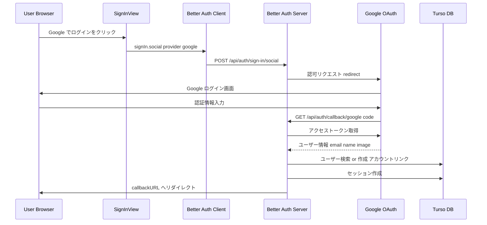
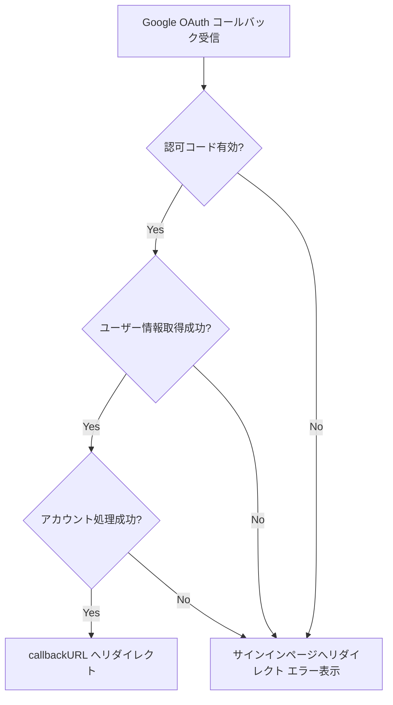

# Technical Design: auth-expansion (Google OAuth)

## Overview

**Purpose**: 本機能は既存の Better Auth 認証基盤に Google OAuth 認証を追加し、ユーザーが Google アカウントでサインイン可能にする。

**Users**: エンドユーザーが Google アカウントを用いて、メール/パスワードを管理する手間なくアプリケーションにアクセスする。

**Impact**: 既存のサインインページに Google OAuth ボタンを追加し、Better Auth の `socialProviders` 設定と環境変数を整備する。スキーマ変更は不要。既存の GitHub OAuth と同一パターンを踏襲する。

### Goals
- Google OAuth による認証フローの完全な動作（認可リクエスト、コールバック処理、セッション確立）
- 同一メールアドレスを持つ既存アカウントとの自動リンク
- エラー発生時の適切なフィードバック表示
- 既存の認証パターン（GitHub OAuth）との一貫性維持

### Non-Goals
- LINE 認証の実装（Requirement 2 -- 別途対応）
- プロフィール編集機能（Requirement 3 -- 別途対応）
- オンボーディングフロー（Requirement 4 -- 別途対応）
- Google API の追加スコープ（Drive、Gmail 等）へのアクセス
- リフレッシュトークンの永続的管理

## Architecture

### Existing Architecture Analysis

現在のシステムは以下の認証パターンを実装済みである。

- **Better Auth サーバー設定** (`lib/auth.ts`): `emailAndPassword`、`socialProviders.github`、`anonymous` プラグイン、Polar プラグインを構成済み。`socialProviders.google` の設定エントリも既に存在する。
- **Better Auth クライアント** (`lib/auth-client.ts`): `anonymousClient`、`polarClient` プラグインを構成済み。`signIn.social` メソッドは GitHub OAuth で利用実績あり。
- **サインイン UI** (`components/features/auth/sign-in-view.tsx`): メール/パスワードフォーム、ゲストログインボタン、GitHub OAuth ボタンを表示。各認証の状態管理（`isLoading`、`error`）を統一的に管理。
- **DB スキーマ** (`db/schemas/auth.ts`): `accounts` テーブルが `provider_id`、`account_id` を持ち、複数プロバイダーの紐付けに対応済み。
- **tRPC プロシージャ階層** (`trpc/init.ts`): `baseProcedure` / `protectedProcedure` / `subscribeProcedure` が定義済み。セッション取得は `auth.api.getSession` を使用。

### Architecture Pattern & Boundary Map

Google OAuth の追加は既存アーキテクチャの拡張であり、新たな境界やコンポーネントの導入は不要である。



**Architecture Integration**:
- **Selected pattern**: 既存の Better Auth socialProviders パターンを踏襲
- **Domain/feature boundaries**: 認証ドメイン内の変更のみ。tRPC・Polar 統合への影響なし
- **Existing patterns preserved**: GitHub OAuth と同一の `signIn.social` フロー、同一のエラーハンドリングパターン
- **New components rationale**: 新規コンポーネントの追加は不要。既存コンポーネントの拡張のみ
- **Steering compliance**: TypeScript strict mode、Feature-first 構造、shadcn/ui コンポーネント利用を維持

### Technology Stack

| Layer | Choice / Version | Role in Feature | Notes |
|-------|------------------|-----------------|-------|
| Frontend | React 19 + Next.js 16 | サインイン UI の Google ボタン追加 | 既存コンポーネントの拡張 |
| Backend | better-auth 1.3.26 | Google OAuth フロー処理、セッション管理 | `socialProviders.google` 設定済み |
| Data | Turso (libSQL) + Drizzle ORM | accounts テーブルへの Google プロバイダー保存 | スキーマ変更不要 |
| UI | shadcn/ui + lucide-react | Google ボタンアイコン | lucide-react に Google アイコンがない場合は SVG で対応 |

## System Flows

### Google OAuth 認証フロー（正常系）

上記シーケンス図に示す通り。Better Auth がコールバック処理、トークン交換、ユーザー作成/リンク、セッション確立を自動で行う。

### エラーフロー



**Key Decisions**:
- Better Auth はコールバックエラー時に自動的にエラー URL へリダイレクトする。クライアント側で `error` state を検知して toast 表示する
- ネットワークエラー等の `signIn.social` 呼び出し失敗は try/catch で捕捉し、GitHub OAuth と同一パターンでハンドリングする

## Requirements Traceability

| Requirement | Summary | Components | Interfaces | Flows |
|-------------|---------|------------|------------|-------|
| 1.1 | Google OAuth 認可フロー開始 | SignInView, AuthClient | signIn.social | Google OAuth 認証フロー |
| 1.2 | コールバック処理、アカウント作成/リンク、セッション確立 | Better Auth Server (既存) | /api/auth/callback/google | Google OAuth 認証フロー |
| 1.3 | OAuth エラー時のリダイレクトとエラー表示 | SignInView | error state, toast | エラーフロー |
| 1.4 | 同一メールの既存アカウントへの Google プロバイダー紐付け | Better Auth Server (既存) | accountLinking (デフォルト有効) | Google OAuth 認証フロー |

> Requirement 5.1（サインインページの統合表示）および 5.2（ローディング状態）も Google OAuth ボタン追加に伴い部分的に対応される。

## Components and Interfaces

| Component | Domain/Layer | Intent | Req Coverage | Key Dependencies (P0/P1) | Contracts |
|-----------|--------------|--------|--------------|--------------------------|-----------|
| SignInView | UI / Auth | サインインページに Google OAuth ボタンを追加 | 1.1, 1.3 | AuthClient (P0), lucide-react or SVG (P1) | State |
| Better Auth Server Config | Backend / Auth | Google OAuth プロバイダー設定 | 1.2, 1.4 | Google OAuth API (P0), Turso DB (P0) | Service |
| Environment Config | Infra / Config | Google OAuth 環境変数の定義 | 1.1, 1.2 | Google Cloud Console (P0) | -- |

### UI / Auth

#### SignInView (既存コンポーネント拡張)

| Field | Detail |
|-------|--------|
| Intent | サインインページに Google OAuth ボタンを追加し、認証フローを開始する |
| Requirements | 1.1, 1.3 |

**Responsibilities & Constraints**
- Google OAuth ボタンの表示とクリックイベント処理
- `isLoading` 状態の共有管理（他の認証ボタンとの排他制御）
- エラー発生時の toast 通知と error state 表示
- 既存の GitHub OAuth ボタンと同一の UX パターンを維持

**Dependencies**
- Outbound: `authClient.signIn.social` -- Google OAuth フロー開始 (P0)
- External: Google アイコン -- lucide-react に含まれない場合は SVG アイコンを使用 (P1)

**Contracts**: State [x]

##### State Management

```typescript
// 既存の state をそのまま利用（追加の state は不要）
// isLoading: boolean -- 全認証ボタンの排他制御
// error: string | null -- エラーメッセージ表示

// Google OAuth ハンドラ（GitHub OAuth と同一パターン）
type HandleGoogleSignIn = () => Promise<void>;
```

**Implementation Notes**
- Integration: `handleGitHubSignIn` と同一パターンで `handleGoogleSignIn` を実装。`provider: "google"` を指定
- Validation: `isLoading` 中は全ボタンを `disabled` にする（既存動作）
- Risks: lucide-react に Google アイコンが存在しない場合、カスタム SVG アイコンコンポーネントの作成が必要

### Backend / Auth

#### Better Auth Server Config (既存設定の整備)

| Field | Detail |
|-------|--------|
| Intent | Better Auth の Google OAuth プロバイダー設定を完備し、認証フロー全体を処理する |
| Requirements | 1.2, 1.4 |

**Responsibilities & Constraints**
- Google OAuth 認可リクエストの生成とリダイレクト
- コールバック URL (`/api/auth/callback/google`) でのトークン交換
- ユーザー情報取得（email, name, image）とアカウント作成/リンク
- セッション確立と `callbackURL` へのリダイレクト
- アカウントリンク: デフォルトで有効。同一メールアドレスかつ Google がメール検証済みの場合に自動リンク

**Dependencies**
- External: Google OAuth 2.0 API -- 認可・トークン交換・ユーザー情報取得 (P0)
- External: Turso DB -- ユーザー/アカウント/セッションの永続化 (P0)

**Contracts**: Service [x]

##### Service Interface

```typescript
// Better Auth が内部的に処理するため、明示的なインターフェース定義は不要
// 以下は Better Auth が提供する既存の API エンドポイント

// POST /api/auth/sign-in/social
// Request: { provider: "google", callbackURL?: string }
// Response: redirect to Google OAuth

// GET /api/auth/callback/google
// Request: { code: string, state: string } (Google からのコールバック)
// Response: redirect to callbackURL with session cookie
```

- Preconditions: `GOOGLE_CLIENT_ID` および `GOOGLE_CLIENT_SECRET` 環境変数が設定済みであること
- Postconditions: 認証成功時に `accounts` テーブルに `provider_id: "google"` のレコードが作成/更新される
- Invariants: 1 ユーザーにつき Google プロバイダーのアカウントレコードは最大 1 つ

**Implementation Notes**
- Integration: `lib/auth.ts` の `socialProviders.google` 設定は既に存在する。環境変数 `GOOGLE_CLIENT_ID` / `GOOGLE_CLIENT_SECRET` の追加のみ必要
- Validation: Better Auth が OAuth コールバックの state パラメータを検証し、CSRF 攻撃を防止する
- Risks: Google Cloud Console でリダイレクト URI を正確に設定しないと `redirect_uri_mismatch` エラーが発生する

### Infra / Config

#### Environment Config (環境変数追加)

| Field | Detail |
|-------|--------|
| Intent | Google OAuth に必要な環境変数を定義する |
| Requirements | 1.1, 1.2 |

**Responsibilities & Constraints**
- `.env.example` に `GOOGLE_CLIENT_ID` / `GOOGLE_CLIENT_SECRET` を追加
- Google Cloud Console での OAuth クライアント作成手順の明示

**Implementation Notes**
- Integration: `.env.example` にエントリを追加。`lib/auth.ts` は既に `process.env.GOOGLE_CLIENT_ID!` / `process.env.GOOGLE_CLIENT_SECRET!` を参照している
- Validation: 環境変数未設定時に Better Auth が起動時エラーを出すか確認が必要
- Risks: 本番環境デプロイ時に環境変数の設定漏れが発生しうる

## Data Models

### Domain Model

Google OAuth の追加によるドメインモデルの変更はない。既存の `users` / `accounts` / `sessions` の関係がそのまま適用される。

- **User**: 1 人のユーザーが複数の Account を持つ（email/password、GitHub、Google）
- **Account**: `provider_id` フィールドで認証プロバイダーを識別（`"credential"` / `"github"` / `"google"`）
- **Session**: 認証方法に関わらず同一のセッション構造

### Logical Data Model

スキーマ変更は不要。Google OAuth ログイン時に `accounts` テーブルへ以下のレコードが挿入される。

| Column | Value |
|--------|-------|
| `id` | nanoid(10) で自動生成 |
| `account_id` | Google ユーザー ID |
| `provider_id` | `"google"` |
| `user_id` | 紐付くユーザーの ID |
| `access_token` | Google アクセストークン |
| `refresh_token` | null（`accessType: "offline"` 未設定のため） |
| `id_token` | Google ID トークン |
| `access_token_expires_at` | トークン有効期限 |
| `scope` | 要求したスコープ |

## Error Handling

### Error Strategy

Google OAuth 固有のエラーは Better Auth がコールバック処理内で捕捉し、エラー状態をクライアントに返す。クライアント側では既存の GitHub OAuth と同一のエラーハンドリングパターンを適用する。

### Error Categories and Responses

| Error Category | Trigger | Response |
|---------------|---------|----------|
| OAuth 認可拒否 | ユーザーが Google 画面でキャンセル | サインインページにリダイレクト。toast でエラー通知 |
| redirect_uri_mismatch | Google Console の設定不一致 | Better Auth がエラーを返す。開発者が Console 設定を修正 |
| アカウントリンク競合 | 稀なケース: 同時リクエスト等 | Better Auth のデフォルトエラーハンドリングに委任 |
| ネットワークエラー | Google API 到達不能 | try/catch で捕捉。toast でエラー通知 |

## Testing Strategy

### Unit Tests
- `handleGoogleSignIn` 関数のロジック: `signIn.social` が `provider: "google"` で呼び出されることを検証
- `isLoading` 状態が正しく切り替わることを検証
- エラーハンドリング: catch ブロックで toast と error state が設定されることを検証

### Integration Tests
- Google OAuth ボタンクリックから `authClient.signIn.social` 呼び出しまでのフロー
- サインインページで全認証ボタン（ゲスト、メール/パスワード、GitHub、Google）が正しく表示されること
- `isLoading` 中に全ボタンが disabled になること

### E2E Tests
- Google OAuth 認証フロー全体（モックプロバイダー使用）
- 新規ユーザーの Google OAuth サインアップ → セッション確立 → ホームページリダイレクト
- 既存ユーザー（メール/パスワード登録済み）の Google OAuth サインイン → アカウントリンク確認

## Security Considerations

- **CSRF 保護**: Better Auth が OAuth state パラメータを使用して CSRF 攻撃を防止する（組み込み機能）
- **トークン保管**: アクセストークンは `accounts` テーブルに保存される。DB アクセスは Turso のトランスポート暗号化で保護
- **スコープ最小化**: デフォルトスコープ（`openid`, `email`, `profile`）のみを要求し、不要な権限は取得しない
- **環境変数管理**: `GOOGLE_CLIENT_SECRET` は Git にコミットしない。`.env.example` にはキー名のみ記載
