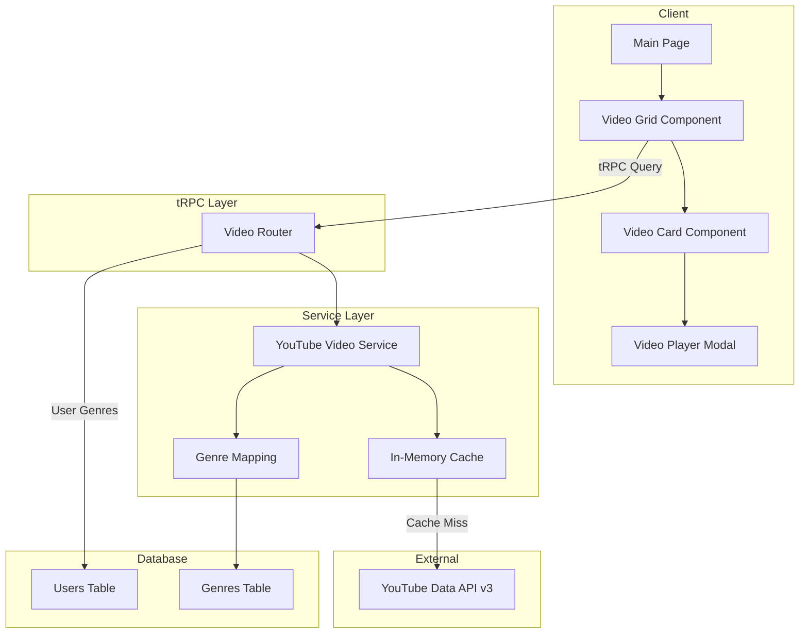
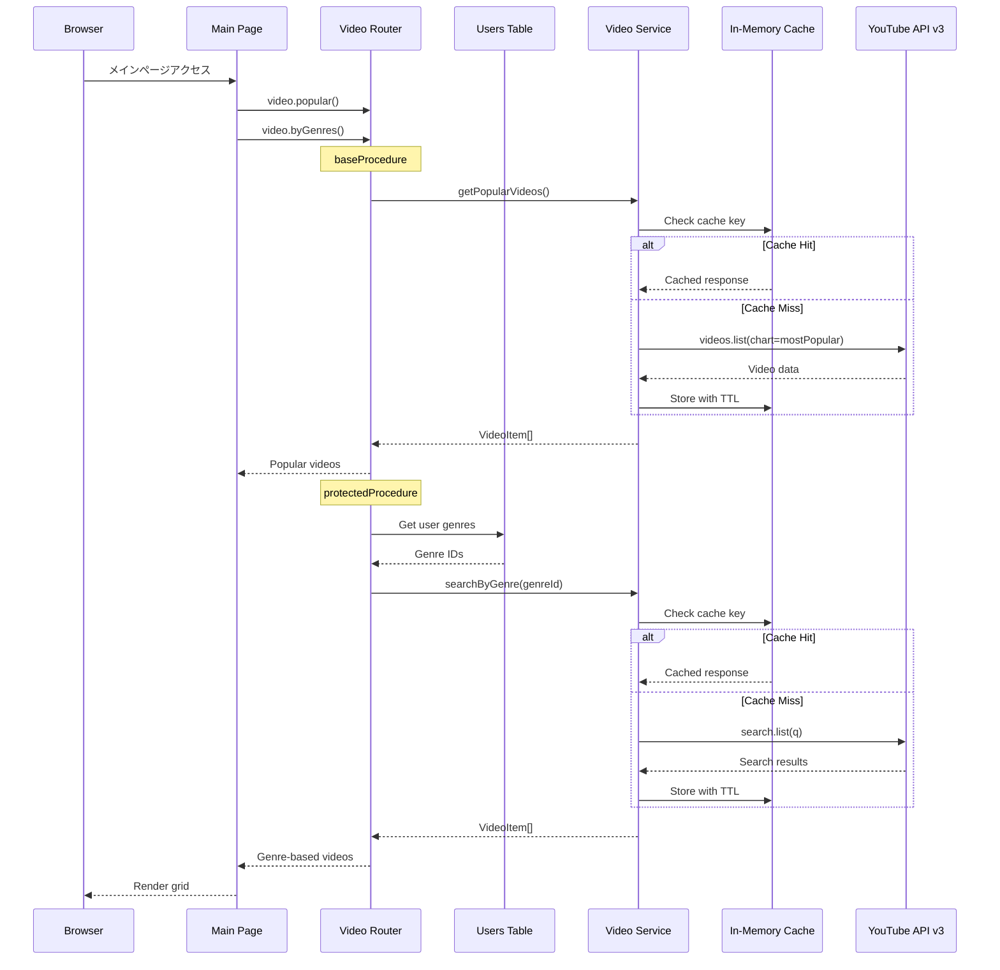

# Technical Design: YouTube動画グリッド表示

## Overview

**Purpose**: メインページにYouTube動画をグリッド形式で表示する機能を提供する。YouTube Data API v3からサーバーサイドで動画データを取得し、tRPCルーターを通じて型安全にクライアントへ配信する。

**Users**: 認証済みユーザーはオンボーディングで選択したジャンルに基づくパーソナライズ動画と人気動画を閲覧する。未認証ユーザーは人気動画セクションのみ閲覧する。

**Impact**: 現在のメインページ（プレースホルダー状態）を動画グリッドUIに置き換え、プロダクトのコア価値である動画コンテンツ配信を実現する。

### Goals
- YouTube Data API v3から動画データを取得し、tRPCで型安全に提供する
- ユーザーのジャンル選択に基づくパーソナライズ動画表示を実現する
- クォータ効率の高いAPI呼び出し戦略を構築する
- レスポンシブなグリッドレイアウトで動画一覧を表示する
- `@next/third-parties/google`のYouTubeEmbedによるインライン動画再生を提供する

### Non-Goals
- YouTube動画のアップロード、編集機能
- 動画の全文検索、フィルタリングUI
- 視聴履歴、お気に入り機能（v1.1で対応予定）
- 動画コメント機能
- サブスクリプション連動の有料/無料動画アクセス制御（本機能では全動画を無料公開）
- Redis等の外部キャッシュインフラ導入

## Architecture

### Existing Architecture Analysis

現在のシステムは以下のパターンに従っている:

- **tRPCプロシージャ階層**: `baseProcedure` → `protectedProcedure` → `subscribeProcedure`で認証レベルを段階的に制約
- **Feature-firstコンポーネント構成**: `components/features/{name}/`に機能UIを集約
- **Drizzle ORM + Turso**: SQLiteベースのデータ層。スキーマ駆動開発
- **ジャンルデータ**: `users.genres`にJSON文字列として格納（最大3ジャンル）

本機能は既存アーキテクチャを拡張し、新たにYouTube Data API v3との外部統合レイヤーを追加する。

### Architecture Pattern & Boundary Map



**Architecture Integration**:
- **Selected pattern**: BFF（Backend for Frontend）+ インメモリキャッシュ。tRPCルーターがYouTube APIとの統合を担い、クライアントにAPIキーを露出しない
- **Domain boundaries**: Video Serviceが外部API統合を担当、Video Routerが認証・パーソナライズのオーケストレーション、UIコンポーネントが表示ロジック
- **Existing patterns preserved**: tRPCプロシージャ階層、Feature-firstコンポーネント構成、Zodバリデーション
- **New components rationale**: Video ServiceはYouTube API抽象化に必要。GenreMapperはアプリジャンル→YouTube検索パラメータ変換に必要。CacheLayerはクォータ効率化に必要
- **Steering compliance**: TypeScript strict mode、型安全なtRPC API、サーバー/クライアント分離

### Technology Stack

| Layer | Choice / Version | Role in Feature | Notes |
|-------|------------------|-----------------|-------|
| Frontend | React 19.2.3 + Next.js 16.1.1 | 動画グリッドUI、ページルーティング | App Router、Server Components |
| 動画再生 | @next/third-parties（latest） | YouTubeEmbed によるlite埋め込み再生 | 新規依存追加 |
| API | @trpc/server 11.9.0 + Zod 4.3.6 | videoルーターによる型安全API | 既存パターン踏襲 |
| External API | YouTube Data API v3 | 動画データ取得（search.list、videos.list） | APIキーによる認証 |
| Data | Drizzle ORM 0.45.1 + Turso | ユーザージャンル情報取得 | 既存スキーマ利用 |
| Cache | Node.js Map（インメモリ） | YouTube APIレスポンスキャッシュ | 新規、外部依存なし |

## System Flows

### 認証済みユーザーの動画取得フロー



**Key Decisions**:
- 人気動画とジャンル別動画は並行してクエリ実行し、独立してレンダリングする
- キャッシュはジャンルID + リージョンをキーとして管理し、TTL 30分で自動更新
- 人気動画は`videos.list(chart=mostPopular)`（1ユニット）を使用し、クォータ効率を最大化

## Requirements Traceability

| Requirement | Summary | Components | Interfaces | Flows |
|-------------|---------|------------|------------|-------|
| 1.1 | YouTube API v3から動画データ取得 | YouTubeVideoService | fetchPopularVideos, searchByGenre | 動画取得フロー |
| 1.2 | APIレスポンスをアプリ形式に変換 | YouTubeVideoService | transformVideoResponse | 動画取得フロー |
| 1.3 | API接続失敗時のエラーハンドリング | YouTubeVideoService, VideoRouter | YouTubeApiError | 動画取得フロー |
| 1.4 | クォータ上限時のエラーハンドリング | YouTubeVideoService | QuotaExceededError | 動画取得フロー |
| 2.1 | 動画一覧tRPCプロシージャ | VideoRouter | video.popular, video.byGenres | 動画取得フロー |
| 2.2 | Zodスキーマによる型安全I/O | VideoRouter | videoItemSchema, videoListResponseSchema | - |
| 2.3 | ジャンルフィルタリング | VideoRouter | video.byGenres | 動画取得フロー |
| 2.4 | 人気順ソート | VideoRouter | video.popular | 動画取得フロー |
| 3.1 | ユーザーのジャンル情報取得 | VideoRouter | protectedProcedure context | 動画取得フロー |
| 3.2 | ジャンル対応動画の取得 | YouTubeVideoService, GenreMapping | searchByGenre | 動画取得フロー |
| 3.3 | ジャンル未選択時のフォールバック | VideoRouter | video.byGenres fallback | 動画取得フロー |
| 3.4 | 複数ジャンルのバランス取得 | VideoRouter | video.byGenres balancing | 動画取得フロー |
| 4.1 | 人気動画セクションデータ提供 | VideoRouter | video.popular | 動画取得フロー |
| 4.2 | 人気動画データ取得 | YouTubeVideoService | fetchPopularVideos | 動画取得フロー |
| 4.3 | ジャンルセクションとの分離 | VideoRouter, VideoGrid | セクション分離構造 | - |
| 5.1 | レスポンシブグリッドレイアウト | VideoGrid | - | - |
| 5.2 | 動画カード表示 | VideoCard | VideoCardProps | - |
| 5.3 | ローディング状態表示 | VideoGridSkeleton | - | - |
| 5.4 | 空状態メッセージ | VideoEmptyState | - | - |
| 5.5 | セクション見出し表示 | VideoSection | VideoSectionProps | - |
| 6.1 | YouTubeEmbed再生表示 | VideoPlayerModal | VideoPlayerModalProps | - |
| 6.2 | 動画ID受け渡し | VideoPlayerModal | videoid prop | - |
| 6.3 | 再生停止・グリッド復帰 | VideoPlayerModal | onClose callback | - |
| 7.1 | 未認証時の人気動画表示 | VideoGrid, MainPage | baseProcedure | 動画取得フロー |
| 7.2 | 未認証時のパーソナライズ非表示 | VideoGrid, MainPage | セッション判定 | - |

## Components and Interfaces

| Component | Domain/Layer | Intent | Req Coverage | Key Dependencies (P0/P1) | Contracts |
|-----------|--------------|--------|--------------|--------------------------|-----------|
| YouTubeVideoService | Service | YouTube API v3との通信抽象化 | 1.1-1.4, 4.2 | YouTube Data API v3 (P0) | Service |
| VideoCache | Service | APIレスポンスのインメモリキャッシュ | 1.1 | なし | Service |
| GenreMapping | Service | ジャンルID→YouTube検索パラメータ変換 | 3.2, 3.4 | genres テーブル (P1) | Service |
| VideoRouter | tRPC | 動画データのtRPCプロシージャ提供 | 2.1-2.4, 3.1, 3.3, 4.1, 4.3 | YouTubeVideoService (P0), Auth (P0) | Service |
| VideoGrid | UI | 動画グリッドレイアウト | 5.1, 5.5, 7.1, 7.2 | VideoRouter (P0) | State |
| VideoCard | UI | 個別動画カード表示 | 5.2 | なし | - |
| VideoPlayerModal | UI | YouTube動画埋め込み再生 | 6.1-6.3 | @next/third-parties (P0) | State |
| VideoGridSkeleton | UI | ローディングスケルトン | 5.3 | なし | - |
| VideoEmptyState | UI | 空状態メッセージ表示 | 5.4 | なし | - |

### Service Layer

#### YouTubeVideoService

| Field | Detail |
|-------|--------|
| Intent | YouTube Data API v3との通信を抽象化し、動画データを取得・変換する |
| Requirements | 1.1, 1.2, 1.3, 1.4, 4.2 |

**Responsibilities & Constraints**
- YouTube Data API v3への全てのHTTPリクエストを管理する
- APIレスポンスをアプリケーション内部の`VideoItem`型に変換する
- エラー（ネットワーク障害、クォータ超過、不正レスポンス）を分類して報告する
- APIキーはサーバーサイドの環境変数から取得し、クライアントに露出しない

**Dependencies**
- External: YouTube Data API v3 -- 動画データソース (P0)
- Outbound: VideoCache -- レスポンスキャッシュ (P1)
- Inbound: VideoRouter -- 動画データリクエスト (P0)

**Contracts**: Service [x] / API [ ] / Event [ ] / Batch [ ] / State [ ]

##### Service Interface
```typescript
interface VideoItem {
  videoId: string;
  title: string;
  thumbnailUrl: string;
  channelName: string;
  publishedAt: string;
  viewCount: string | null;
}

type YouTubeApiErrorCode = "NETWORK_ERROR" | "QUOTA_EXCEEDED" | "INVALID_RESPONSE" | "UNKNOWN";

interface YouTubeApiError {
  code: YouTubeApiErrorCode;
  message: string;
  statusCode: number | null;
}

type VideoServiceResult<T> =
  | { success: true; data: T }
  | { success: false; error: YouTubeApiError };

interface YouTubeVideoService {
  fetchPopularVideos(params: {
    maxResults: number;
    regionCode: string;
  }): Promise<VideoServiceResult<VideoItem[]>>;

  searchByGenre(params: {
    genreId: string;
    maxResults: number;
    regionCode: string;
  }): Promise<VideoServiceResult<VideoItem[]>>;
}
```
- Preconditions: `YOUTUBE_API_KEY`環境変数が設定済みであること
- Postconditions: 成功時は`VideoItem[]`を返却。失敗時は分類済みエラーを返却
- Invariants: APIキーがクライアントに露出しないこと。レスポンスは常に`VideoServiceResult`型に統一

**Implementation Notes**
- Integration: `search.list`（ジャンル別、100ユニット/回）と`videos.list(chart=mostPopular)`（人気、1ユニット/回）を使い分ける。`search.list`のレスポンスには`statistics`が含まれないため、必要に応じて`videos.list`で補完する
- Validation: APIレスポンスのフィールド欠損に対する防御的パース。`snippet`の必須フィールド（title, thumbnails, channelTitle）の存在確認
- Risks: YouTube APIのレスポンス構造変更。緩和策としてZodスキーマによるランタイムバリデーション

#### VideoCache

| Field | Detail |
|-------|--------|
| Intent | YouTube APIレスポンスをインメモリキャッシュし、クォータ消費を削減する |
| Requirements | 1.1 |

**Responsibilities & Constraints**
- キャッシュキー（ジャンルID + リージョン等）とTTLに基づくキャッシュ管理
- TTL経過後のエントリ自動無効化
- サーバープロセス内のメモリに格納（外部依存なし）

**Dependencies**
- Inbound: YouTubeVideoService -- キャッシュ読み書き (P0)

**Contracts**: Service [x] / API [ ] / Event [ ] / Batch [ ] / State [ ]

##### Service Interface
```typescript
interface CacheEntry<T> {
  data: T;
  expiresAt: number;
}

interface VideoCache {
  get<T>(key: string): T | null;
  set<T>(key: string, data: T, ttlMs: number): void;
  invalidate(key: string): void;
  clear(): void;
}
```
- Preconditions: なし
- Postconditions: `get`はTTL内のエントリを返却し、期限切れは`null`を返却
- Invariants: TTL超過エントリは読み取り時に自動削除

**Implementation Notes**
- Integration: デフォルトTTLは30分（1,800,000ms）。人気動画とジャンル別動画で同じキャッシュインスタンスを共有
- Risks: メモリリーク。緩和策としてキャッシュエントリ数上限（例: 100件）を設ける

#### GenreMapping

| Field | Detail |
|-------|--------|
| Intent | アプリ内ジャンルID（DBの`genres.id`）をYouTube search.list APIの検索キーワード（`q`パラメータ）に変換する |
| Requirements | 3.2, 3.4 |

**Responsibilities & Constraints**
- ジャンルIDからYouTube search.list APIの`q`パラメータに渡す検索キーワードへのマッピングを提供する
- YouTube APIの`videoCategoryId`は汎用カテゴリ（Film & Animation, Comedy等）しかなく、アプリのジャンル（アクション, ホラー, SF等）と1:1で対応しないため使用しない。`searchQuery`のみで絞り込みを行う
- 未マッピングジャンルに対するフォールバック値を定義する

**Dependencies**
- Inbound: VideoRouter -- マッピング参照 (P0)

**Contracts**: Service [x] / API [ ] / Event [ ] / Batch [ ] / State [ ]

##### Service Interface
```typescript
interface YouTubeSearchParams {
  /** YouTube search.list API の q パラメータに渡す検索キーワード */
  searchQuery: string;
}

interface GenreMapping {
  getYouTubeParams(genreId: string): YouTubeSearchParams;
  isSupported(genreId: string): boolean;
  getDefaultParams(): YouTubeSearchParams;
}
```
- Preconditions: なし
- Postconditions: 常に有効な`YouTubeSearchParams`を返却（未マッピング時はデフォルト値）
- Invariants: マッピングは定数として定義され、ランタイムで変更されない

**Implementation Notes**
- Integration: `lib/youtube/genre-mapping.ts`に定数オブジェクトとして定義。キーはDBの`genres`テーブルの`id`カラムと一致する（例: `action`, `comedy`, `sci-fi`）
- Validation: `isSupported`でマッピング存在確認後、`getYouTubeParams`を呼び出すパターンを推奨
- Risks: ジャンルマスタデータとマッピングの不整合。緩和策として未マッピング時のフォールバック保証

### tRPC Layer

#### VideoRouter

| Field | Detail |
|-------|--------|
| Intent | 動画データを型安全なtRPCプロシージャとして提供する |
| Requirements | 2.1, 2.2, 2.3, 2.4, 3.1, 3.3, 3.4, 4.1, 4.3 |

**Responsibilities & Constraints**
- `video.popular`: 人気動画を取得するpublicプロシージャ（`baseProcedure`）
- `video.byGenres`: ユーザーのジャンルに基づくパーソナライズ動画を取得するprotectedプロシージャ
- 入出力のZodスキーマ定義による型安全性の保証
- 複数ジャンルの動画をバランスよく取得するロジック

**Dependencies**
- Outbound: YouTubeVideoService -- 動画データ取得 (P0)
- Outbound: GenreMapping -- ジャンル変換 (P0)
- Outbound: Users Table -- ユーザージャンル取得 (P0)
- Inbound: VideoGrid -- クライアントからのクエリ (P0)
- External: tRPC init -- baseProcedure / protectedProcedure (P0)

**Contracts**: Service [x] / API [ ] / Event [ ] / Batch [ ] / State [ ]

##### Service Interface
```typescript
// Zod Schemas
const videoItemSchema = z.object({
  videoId: z.string(),
  title: z.string(),
  thumbnailUrl: z.string().url(),
  channelName: z.string(),
  publishedAt: z.string(),
  viewCount: z.string().nullable(),
});

const popularVideosInputSchema = z.object({
  maxResults: z.number().min(1).max(50).default(12),
}).optional();

const genreVideosInputSchema = z.object({
  maxResults: z.number().min(1).max(50).default(8),
}).optional();

// Router Procedures
interface VideoRouterProcedures {
  popular: {
    // baseProcedure.input(popularVideosInputSchema).query
    input: z.infer<typeof popularVideosInputSchema>;
    output: {
      videos: z.infer<typeof videoItemSchema>[];
    };
  };
  byGenres: {
    // protectedProcedure.input(genreVideosInputSchema).query
    input: z.infer<typeof genreVideosInputSchema>;
    output: {
      sections: Array<{
        genreId: string;
        genreLabel: string;
        videos: z.infer<typeof videoItemSchema>[];
      }>;
    };
  };
}
```
- Preconditions: `video.byGenres`は認証済みセッションが必要
- Postconditions: `video.popular`は人気動画配列を返却。`video.byGenres`はジャンル別セクション配列を返却
- Invariants: 全レスポンスは`videoItemSchema`に準拠。認証エラーは`TRPCError(UNAUTHORIZED)`として返却

**Implementation Notes**
- Integration: ルートルーター（`_app.ts`）に`video: videoRouter`として登録。`protectedProcedure`の`ctx.auth`からユーザーIDを取得し、`users.genres`カラムからジャンルIDを取得
- Validation: `video.byGenres`でユーザーのジャンルが空の場合、人気動画をフォールバックとして返却（3.3対応）。複数ジャンル時は各ジャンルから`maxResults`件ずつ取得し結合（3.4対応）
- Risks: 複数ジャンルの並行API呼び出しによるクォータ消費増大。緩和策としてキャッシュ活用とジャンル数上限（最大3）の既存制約を利用

### UI Layer

UIコンポーネントは既存のshadcn/ui + Tailwind CSSパターンに従う。以下に共通Propsの基底型を定義する。

```typescript
interface BaseVideoGridProps {
  className?: string;
}
```

#### VideoGrid

| Field | Detail |
|-------|--------|
| Intent | 動画セクション（人気動画・ジャンル別）をグリッドレイアウトで統合表示する |
| Requirements | 5.1, 5.5, 7.1, 7.2 |

**Responsibilities & Constraints**
- 認証状態に応じて表示セクションを制御する
- tRPCクエリの状態（loading / error / success）に応じたUI切り替え
- レスポンシブグリッド: モバイル1列、タブレット2列、デスクトップ3-4列

**Dependencies**
- Outbound: VideoRouter -- tRPCクエリ (P0)
- Outbound: VideoCard, VideoSection, VideoGridSkeleton, VideoEmptyState -- 子コンポーネント (P1)

**Contracts**: Service [ ] / API [ ] / Event [ ] / Batch [ ] / State [x]

##### State Management
- State model: tRPC `useQuery`によるサーバー状態管理。選択中の動画ID（`selectedVideoId: string | null`）をローカルstateで管理
- Persistence & consistency: サーバーキャッシュはReact Queryが管理。`staleTime`設定でクライアント側の再フェッチ頻度を制御
- Concurrency strategy: React Queryのデフォルト動作（バックグラウンド再フェッチ、重複排除）

**Implementation Notes**
- Integration: `"use client"`ディレクティブが必要。`components/features/home/video-grid.tsx`に配置
- Risks: 大量の動画カードによる初期レンダリング負荷。緩和策としてグリッド件数を制限（人気12件、ジャンル別各8件）

#### VideoCard

| Field | Detail |
|-------|--------|
| Intent | 個別の動画情報をカード形式で表示する |
| Requirements | 5.2 |

**Summary-only**: サムネイル画像、タイトル、チャンネル名を表示する表示専用コンポーネント。`VideoItem`型のデータとクリックハンドラを受け取る。`components/features/home/video-card.tsx`に配置。

```typescript
interface VideoCardProps extends BaseVideoGridProps {
  video: VideoItem;
  onSelect: (videoId: string) => void;
}
```

#### VideoPlayerModal

| Field | Detail |
|-------|--------|
| Intent | YouTubeEmbedコンポーネントを使用してモーダル形式で動画を再生する |
| Requirements | 6.1, 6.2, 6.3 |

**Responsibilities & Constraints**
- `@next/third-parties/google`の`YouTubeEmbed`コンポーネントをラップする
- モーダルオーバーレイで動画を再生し、閉じる操作で停止・グリッド復帰を実現する
- アクセシビリティ対応（ESCキー、オーバーレイクリックで閉じる）

**Dependencies**
- External: @next/third-parties/google -- YouTubeEmbed (P0)
- External: shadcn/ui Dialog -- モーダルUI (P1)

**Contracts**: Service [ ] / API [ ] / Event [ ] / Batch [ ] / State [x]

##### State Management
- State model: `isOpen: boolean`をshadcn/ui Dialogの`open`プロパティで管理。親コンポーネント（VideoGrid）から`selectedVideoId`を受け取る
- Persistence & consistency: コンポーネントローカル。閉じる操作で親にコールバック通知

```typescript
interface VideoPlayerModalProps {
  videoId: string;
  videoTitle: string;
  open: boolean;
  onOpenChange: (open: boolean) => void;
}
```

**Implementation Notes**
- Integration: `components/features/home/video-player-modal.tsx`に配置。`"use client"`ディレクティブ必須
- Validation: `videoId`が空文字の場合はレンダリングしない
- Risks: YouTubeEmbedのexperimentalステータス。緩和策として標準iframe埋め込みへのフォールバックを検討

#### VideoGridSkeleton

**Summary-only**: 動画読み込み中のスケルトンUI。`components/features/home/video-grid-skeleton.tsx`に配置。shadcn/ui Skeletonコンポーネントを使用し、VideoCardと同じグリッドレイアウトでプレースホルダーを表示する（5.3対応）。

#### VideoEmptyState

**Summary-only**: 動画が見つからない場合の空状態メッセージ。`components/features/home/video-empty-state.tsx`に配置（5.4対応）。

#### VideoSection

**Summary-only**: セクション見出し（ジャンル名、「人気の動画」等）とその配下の動画グリッドをグルーピングするラッパーコンポーネント。`components/features/home/video-section.tsx`に配置（5.5対応）。

```typescript
interface VideoSectionProps extends BaseVideoGridProps {
  title: string;
  children: React.ReactNode;
}
```

## Data Models

### Domain Model

- **VideoItem**: YouTube動画のサマリー情報を表す値オブジェクト。`videoId`で一意識別
- **GenreVideoSection**: ジャンルIDとラベル、およびそのジャンルに属するVideoItem配列を持つ
- **Business Rules**:
  - ユーザーは最大3ジャンルを選択可能（既存制約）
  - ジャンル未選択時は人気動画をフォールバック表示
  - 未認証ユーザーはジャンル別セクション非表示

### Data Contracts & Integration

**YouTube Data API v3 リクエスト/レスポンス**

人気動画取得:
```
GET https://www.googleapis.com/youtube/v3/videos
  ?part=snippet,statistics
  &chart=mostPopular
  &regionCode=JP
  &maxResults=12
  &key={API_KEY}
```

ジャンル別動画検索:
```
GET https://www.googleapis.com/youtube/v3/search
  ?part=snippet
  &type=video
  &q={searchQuery}
  &order=viewCount
  &regionCode=JP
  &relevanceLanguage=ja
  &maxResults=8
  &key={API_KEY}
```
※ `videoCategoryId`は使用しない。YouTubeのカテゴリはアプリのジャンルと1:1で対応しないため、`q`（検索キーワード）のみで絞り込みを行う。

**tRPC レスポンス構造**

`video.popular`レスポンス:
```typescript
{
  videos: VideoItem[]  // 最大12件
}
```

`video.byGenres`レスポンス:
```typescript
{
  sections: Array<{
    genreId: string;
    genreLabel: string;
    videos: VideoItem[];  // ジャンル毎最大8件
  }>
}
```

## Error Handling

### Error Strategy

| Error Type | Category | Response | Recovery |
|------------|----------|----------|----------|
| YouTube API接続失敗 | System (5xx) | TRPCError INTERNAL_SERVER_ERROR | キャッシュからの古いデータ返却を試行。不可なら空配列 + エラーメッセージ |
| クォータ超過 | System (429) | TRPCError TOO_MANY_REQUESTS | クライアントにクォータ超過を通知。キャッシュデータがあればそれを返却 |
| 不正なAPIレスポンス | System (5xx) | TRPCError INTERNAL_SERVER_ERROR | ログ記録、空配列返却 |
| 認証エラー（byGenres） | User (401) | TRPCError UNAUTHORIZED | クライアントでログインページへ誘導 |
| 無効なジャンルID | Business (422) | フォールバック動画を返却 | GenreMappingのデフォルトパラメータ使用 |

### Monitoring
- YouTube APIエラーレスポンスのコンソールログ記録（エラーコード、メッセージ、リクエストパラメータ）
- クォータ消費量の定期的な確認（Google Cloud Console）

## Testing Strategy

### Unit Tests
- YouTubeVideoService: APIレスポンスの`VideoItem`変換ロジック
- VideoCache: TTL動作（有効期限内のget、期限切れのget、invalidate）
- GenreMapping: 全ジャンルIDのマッピング解決、未マッピングIDのフォールバック
- VideoRouter: ジャンル未選択時のフォールバックロジック

### Integration Tests
- VideoRouter + YouTubeVideoService: モックAPI経由での人気動画取得フロー
- VideoRouter + DB: protectedProcedureによるユーザージャンル取得からの動画返却
- VideoCache + YouTubeVideoService: キャッシュヒット/ミス時の動作

### E2E Tests
- 認証済みユーザー: メインページアクセス→人気動画セクション + ジャンル別セクション表示確認
- 未認証ユーザー: メインページアクセス→人気動画セクションのみ表示確認
- 動画カードクリック→モーダル再生→閉じる操作の一連のフロー
- ローディング状態のスケルトン表示確認

## Security Considerations

- **APIキー保護**: `YOUTUBE_API_KEY`はサーバーサイド環境変数としてのみ使用。`server-only`パッケージでクライアントバンドルへの混入を防止
- **入力バリデーション**: tRPCプロシージャの入力をZodスキーマで検証。`maxResults`の範囲制約（1-50）でAPI悪用を防止
- **認証制御**: ジャンル別動画取得は`protectedProcedure`で認証を強制

## Performance & Scalability

- **クォータ効率**: `videos.list(chart=mostPopular)` = 1ユニット/回 vs `search.list` = 100ユニット/回。キャッシュTTL 30分で1日のAPI呼び出しを最小化
- **レンダリング最適化**: YouTubeEmbedの`lite-youtube-embed`による遅延読み込み。サムネイル画像は`next/image`の最適化を検討
- **クライアントキャッシュ**: React Queryの`staleTime`を5分に設定し、ページ内遷移での再フェッチを抑制
- **スケーリング制約**: インメモリキャッシュは単一プロセスに限定。複数インスタンス構成が必要になった場合はRedis等への移行を検討
